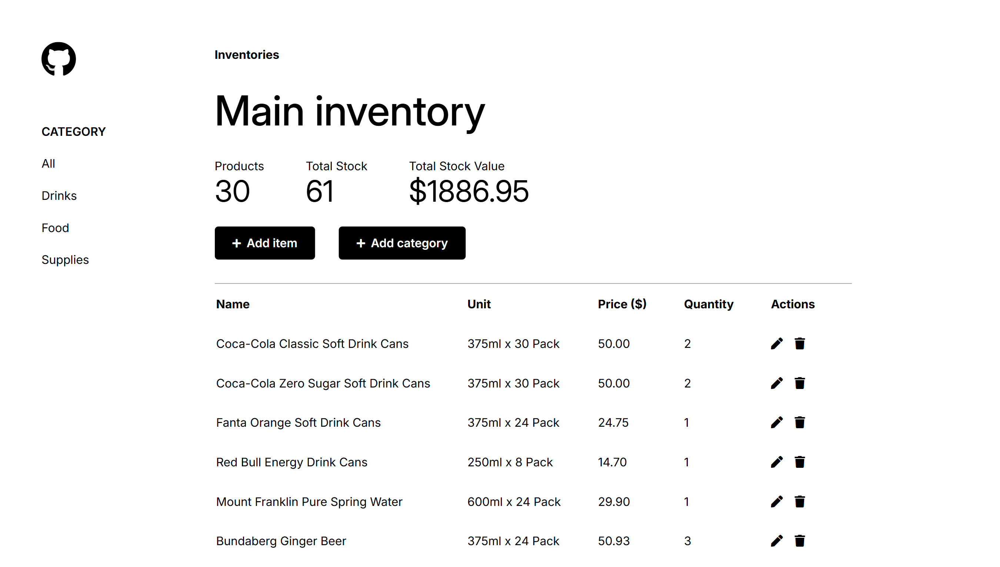
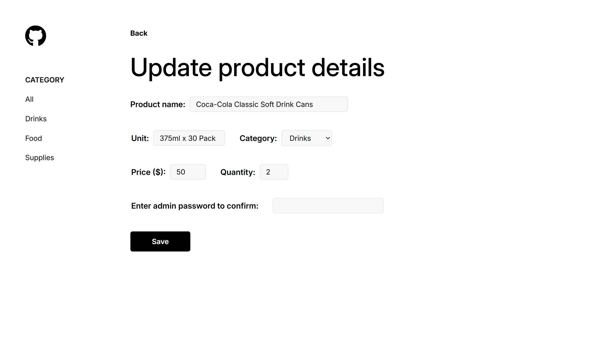

# Inventory Application

The Odin Project - NodeJS Course Project (2/8):

A simple restaurant-based inventory management application built with Express and PostgreSQL.
This application is deployed on Render, and the database is hosted on Supabase.

## Features

- CRUD operations: Manage products/categories with full CRUD functionality
- Admin authentication: restrict critical CRUD actions to admin users only (password confirmation)
- Category management: organize products by categories and get summary of stock levels, prices, and total value for each category
- Form validation: ensures all product/category data meet required data constraints

## Preview

## Links

Live link: https://inventory-application-nhzy.onrender.com/

Assignment: https://www.theodinproject.com/lessons/node-path-nodejs-inventory-application
